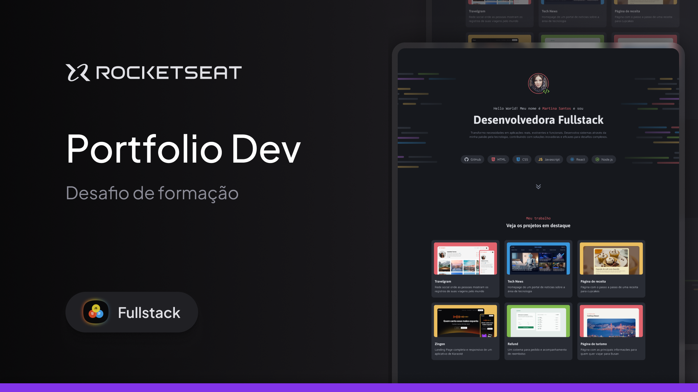

<h1 align="center"> Desafio Portifolio Dev </h1>

O Primeiro desafio pratico da trilha Full-Stack, promovido pela Rocketseat para ensino de tecnologias WEB.  

  <a href="#-tecnologias">Tecnologias</a>&nbsp;&nbsp;&nbsp;|&nbsp;&nbsp;&nbsp;
  <a href="#-projeto">Projeto</a>&nbsp;&nbsp;&nbsp;|&nbsp;&nbsp;&nbsp;
  <a href="#-layout">Layout</a>&nbsp;&nbsp;&nbsp;|&nbsp;&nbsp;&nbsp;
  <a href="#memo-licença">Licença</a>

  

 

  

## 🚀 Tecnologias

Esse Modulo vem com conteudos basicos e iniciais para o entendimento das seguintes tecnologias:

- HTML e CSS
  - estrutura HTML
  - Criação de Layouts
  - Posicionamento de elementos
  - Variaveis CSS
  - CSS Flexbox
  - CSS Grid
  - Pseudo-class e pseudo-elements
- Git e Github
- Figma

## 💻 Projeto

- [Visite o projeto online](https://kelvingomes13.github.io/Portifolio-dev/)

## 🔖 Layout

Você pode visualizar o layout do projeto através [DESSE LINK](https://www.figma.com/community/file/1387080701963671866). É necessário ter conta no [Figma](https://figma.com) para acessá-lo.
## 📚  Experiencia
Conquistamos conhecimentos sobre nossas proprias falhas e percebemos a importancia de manter organização e padrão nas linhas de codigo, mantendo a limpeza do projeto.
Manter a pratica, pesquisa e leitura agregando conhecimento a caminhada.

## 🎫 Licença

Esse projeto está sob a licença MIT.

---

Feito com ♥ by Rocketseat
# PROJETO-PORTIFOLIO-DEV
# PROJETO-PORTIFOLIO-DEV
